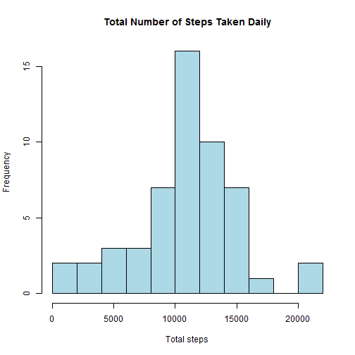
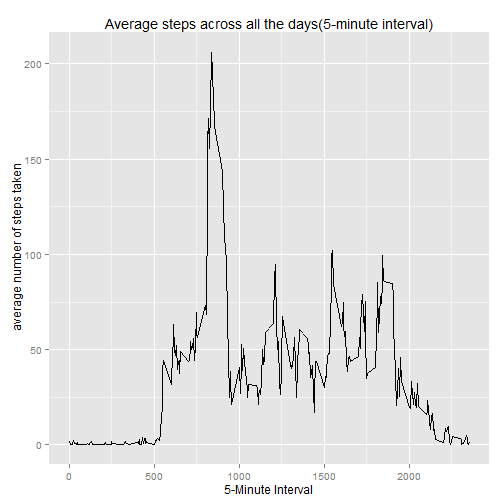
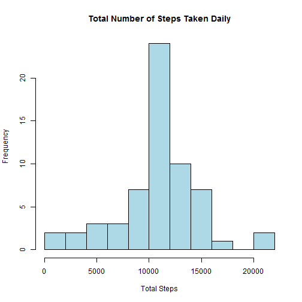

### Introduction
This assignment makes use of data from a personal activity monitoring device. This device collects data at 5 minute intervals through out the day. The data consists of two months of data from an anonymous individual collected during the months of October and November, 2012 and include the number of steps taken in 5 minute intervals each day.
The dataset is stored in a comma-separated-value (CSV) file and there are a total of 17,568 observations in this dataset.

### Loading and preprocessing the data
Call libraries

```r
library(lattice)
library(plyr)
library(ggplot2)
```
Read csv file

```r
df <- read.csv("activity.csv", colClasses = c("numeric", "character", "numeric"))
```

### What is mean total number of steps taken per day?
1.   The date on which the measurement was taken in YYYY-MM-DD format
2.   Ignore the missing values in the dataset
3.   Plot a histogram of the total number of steps taken each day

```r
df$date <- as.Date(df$date, "%Y-%m-%d")
head(df)
```

```
##   steps       date interval
## 1    NA 2012-10-01        0
## 2    NA 2012-10-01        5
## 3    NA 2012-10-01       10
## 4    NA 2012-10-01       15
## 5    NA 2012-10-01       20
## 6    NA 2012-10-01       25
```

```r
TotalSteps <- aggregate(steps ~ date, data = df, sum, na.rm = TRUE)
hist(TotalSteps$steps, main = "Total Number of Steps Taken Daily", breaks=10, xlab = "Total steps", col = "lightblue")
```

 

Report the mean and median of steps taken per day

```r
mean(TotalSteps$steps);
```

```
## [1] 10766.19
```

```r
median(TotalSteps$steps);
```

```
## [1] 10765
```


### What is the average daily activity pattern?
1.   Make a time series plot (i.e. type = "l") of the 5-minute interval (x-axis) and the average number of steps taken, averaged across all days (y-axis)

2.   Which 5-minute interval, on average across all the days in the dataset, contains the maximum number of steps?

```r
df_na_omit <- na.omit(df) 
df_mean <- ddply(df_na_omit,~interval, summarise, mean=mean(steps))
qplot(x=interval, y=mean, data=df_mean, geom="line",
      xlab="5-Minute Interval",
      ylab=" average number of steps taken",
      main="Average steps across all the days(5-minute interval)"
      )
```

 

### Imputing missing values
1.   Calculate and report the total number of missing values in the dataset (i.e. the total number of rows with NAs)

2.   Devise a strategy for filling in all of the missing values in the dataset. The strategy does not need to be sophisticated. For example, you could use the mean/median for that day, or the mean for that 5-minute interval, etc.

3.   Create a new dataset that is equal to the original dataset but with the missing data filled in.

4.   Make a histogram of the total number of steps taken each day and Calculate and report the mean and median total number of steps taken per day. Do these values differ from the estimates from the first part of the assignment? What is the impact of imputing missing data on the estimates of the total daily number of steps?

Total missing values

```r
df_na_val <- df[is.na(df)]
length(df_na_val)
```

```
## [1] 2304
```
Calculate the mean and fill the NA records to new dataset(df_fill)

```r
AvgSteps <- aggregate(steps ~ interval, data = df, FUN = mean)
df_fill <- df
for (i in 1:nrow(df)) {
     obs <- df[i , ] 
     if (is.na(obs$steps)) {
          df_fill[i,] <- data.frame(subset(AvgSteps, interval == obs$interval)$steps,as.Date(df[i ,2 ]),df[i , 3])
     } 
}
```
Make a histogram of the total number of steps

```r
df_fill$date <- as.Date(df_fill$date, "%Y-%m-%d")
TotalStep <- aggregate(steps ~ date, data = df_fill, sum, na.rm = TRUE)
hist(TotalStep$steps, main = "Total Number of Steps Taken Daily", breaks=10, xlab = "Total Steps", col = "lightblue")
```

 

### Are there differences in df patterns between weekdays and weekends?
1.   Create a new factor variable in the dataset with two levels - "weekday" and "weekend" indicating whether a given date is a weekday or weekend day.

2.   Make a panel plot containing a time series plot (i.e. type = "l") of the 5-minute interval (x-axis) and the average number of steps taken, averaged across all weekday days or weekend days (y-axis). See the README file in the GitHub repository to see an example of what this plot should look like using simulated data.

Create a new factor variable in the dataset with two levels - "weekday" and "weekend"

```r
df$day <- weekdays(df$date)
df$weekdesc[df$day == "Monday" | df$day == "Tuesday" | df$day == "Wednesday" | df$day == "Thursday" | df$day == "Friday"]    <- "weekday"
df$weekdesc[df$day == "Saturday" | df$day == "Sunday"]    <- "weekend"
summary(as.factor(df$weekdesc))
```

```
## weekday weekend 
##   12960    4608
```
Create a panel plot of the 5-minute interval (x-axis) and the average number of steps taken in weekday and weekend.

```r
TotalstepsByDay <- aggregate(steps ~ interval + weekdesc, data = df, mean)
names(TotalstepsByDay) <- c("interval", "weekdesc", "steps")
xyplot(steps ~ interval | weekdesc, TotalstepsByDay, type = "l", layout = c(1, 2),
       main="Average steps taken in All Weekday or Weekend",xlab = "5-minute interval", ylab = "average number of steps taken")
```

 
